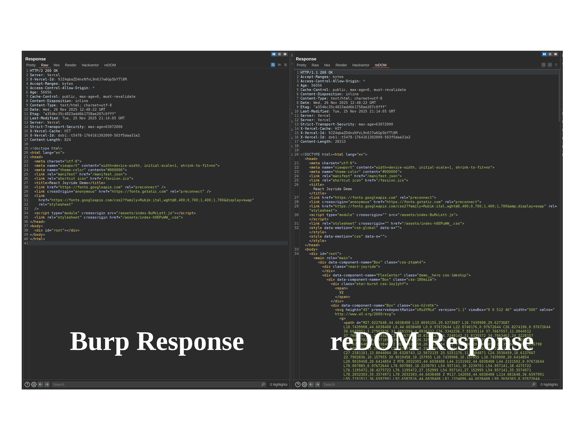

# reDOM

```
  ██████╗ ███████╗██████╗  ██████╗ ███╗   ███╗
  ██╔══██╗██╔════╝██╔══██╗██╔═══██╗████╗ ████║
  ██████╔╝█████╗  ██║  ██║██║   ██║██╔████╔██║
  ██╔══██╗██╔══╝  ██║  ██║██║   ██║██║╚██╔╝██║
  ██║  ██║███████╗██████╔╝╚██████╔╝██║ ╚═╝ ██║
  ╚═╝  ╚═╝╚══════╝╚═════╝  ╚═════╝ ╚═╝     ╚═╝
```

A Burp Suite extension that brings full DOM rendering capabilities directly into Burp, enabling effective security testing of modern JavaScript-heavy applications built with frameworks like ReactJS, VueJS, Angular, and more.



## Features

- Captures fully-rendered DOM after JavaScript execution
- Analyzes Single Page Applications (SPAs) built with React, Vue.js, Angular, etc.
- Integrates as a custom response tab in Burp Repeater
- Launches and manages the browser directly from the extension
- Configurable rendering and connection parameters

## Requirements

- Burp Suite Professional/Community
- Chrome/Chromium browser

## Installation

1. Build the extension:
   ```bash
   mvn clean package
   ```

2. Load `target/reDOM.jar` in Burp Suite (Extensions → Add)

## Usage

1. Load the extension — the settings panel opens automatically

2. Configure browser path, upstream proxy, and profile directory as needed

3. Click **Launch & Connect** to start the browser and connect

4. Send a request to Repeater and switch to the **DOM Render** tab

## Configuration

| Setting | Description | Default |
|---|---|---|
| Browser path | Path to the Chromium executable | `chromium` |
| Upstream proxy | Burp proxy address | `localhost:8080` |
| Profile directory | Browser profile to use | `/tmp/redom` |
| Accept invalid certificates | Trust self-signed and invalid TLS certs | on |
| Launch browser on startup | Automatically launch browser when extension loads | off |
| Host / Port | Remote debugging address | `localhost:9222` |
| Command timeout | CDP command timeout | `30s` |
| Post-load delay | Wait time after page load for JS to settle | `1000ms` |
| Load timeout | Maximum time to wait for page load | `30s` |
| Render on tab selection | Render automatically when the DOM Render tab is opened | on |
| Pretty-print HTML | Format the rendered HTML output | on |

## License

MIT License
